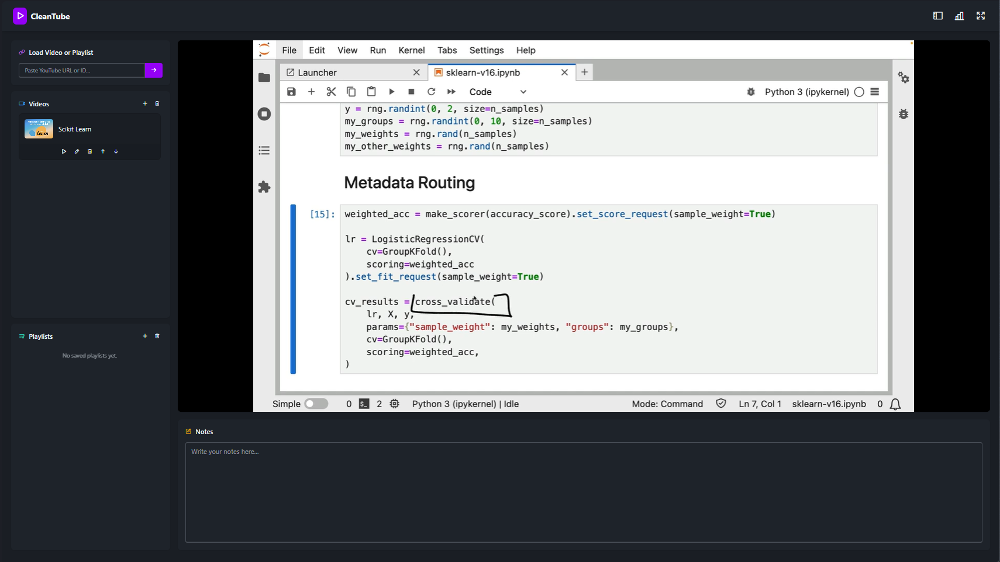
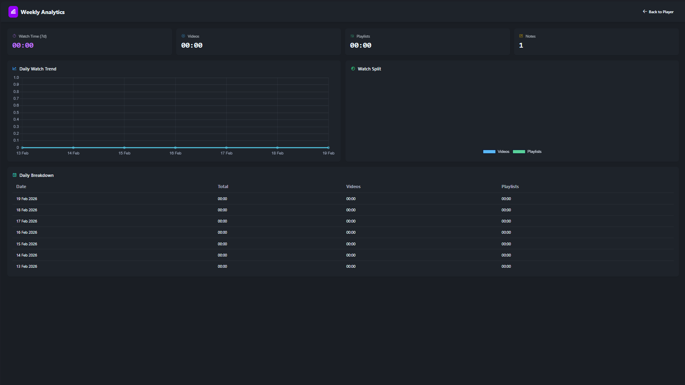

# CleanTube

A distraction-light YouTube player with saved videos/playlists, per-item notes, timestamp notes, resume playback, and analytics.

## Screenshot

|  |
|---|
|  |

## Stack

- DaisyUI 5
- Vanilla JS
- Tailwind CSS
- YouTube NoCookie

## Features

- Save and manage videos/playlists
- URL parsing (watch, shorts, youtu.be, embed, playlists)
- Per-item notes with autosave
- Timeline notes with click-to-seek
- Resume playback position
- Weekly analytics

## Usage

Open `index.html` in a browser.

## Proxy Parameters

`proxy.html` accepts:

- `?v=VIDEO_ID`
- `?list=PLAYLIST_ID`
- `autoplay=0|1`
- `playsinline=0|1`
- `start=<seconds>`
